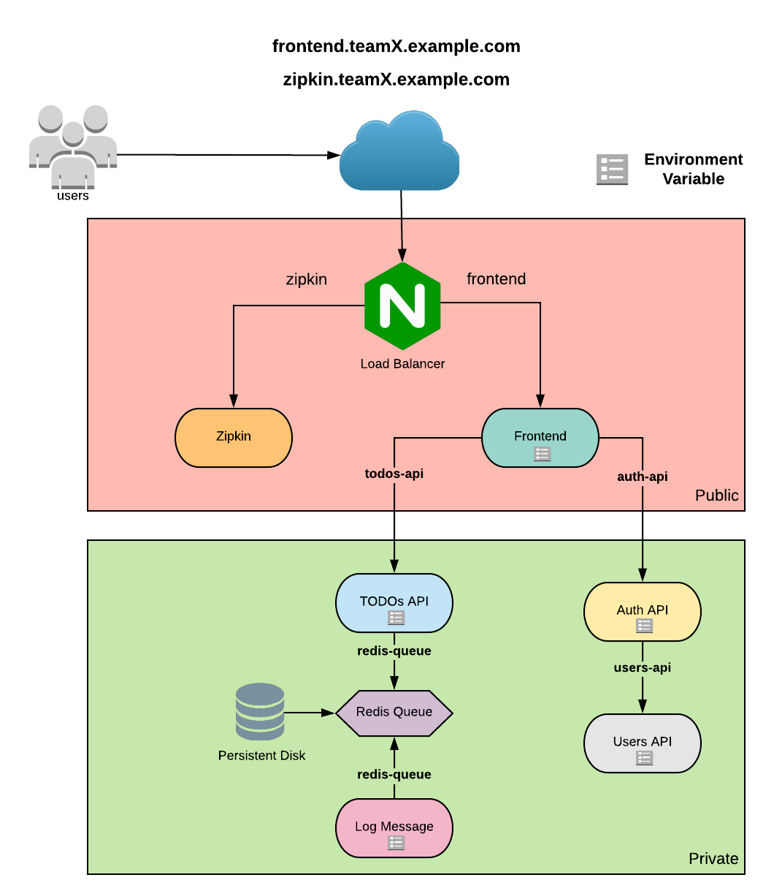
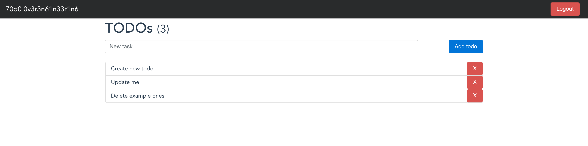

# Challenge

In this challenge, you will have to deploy a TODO application to a Kubernetes cluster which will be provided to you. This application comprises of seven microservices written in different programming languages and you can find it in this Github repository: [https://github.com/elgris/microservice-app-example](https://github.com/elgris/microservice-app-example).

# How the Challenge is Structured

The challenge will start with an overview of the solution architecture, followed by a few sections to help you set up your environment. Then, there will be number of sections where each one of them tackles a small piece of the puzzle. And to make sure you've figured out each small piece correctly, there will be **Definition of Done** sections to show you how to test your solution. Finally, from time to time you will see **For discussion** sections (which are optional and can be skipped). The goal of these sections is to create a discussion between the team members and the organizers about a certain topic.

# Architecture

This is the final architecture of the application once it's running on Kubernetes:



Here's a summary of the architecture:

* There will be two public services: Zipkin and Frontend
* Both Zipkin and Frontend will be served by only one Load Balancer
* A few services will need to be configured with Environment Variables (Frontend, TODOs API, Auth API, Log Message and Users API)
* Services can communicate internally with other services via private DNS names
* The Redis Queue service will persist its data in a persistent disk that sits outside of the cluster

# Cloning the Application Repository

As aforementioned, you will be deploying seven microservices. To get started, clone this repository anywhere in your system (for Windows users: clone the repo under your home directory to avoid issues when mounting a volume into a Docker container): [https://github.com/elgris/microservice-app-example](https://github.com/elgris/microservice-app-example)

# Accessing `kubectl`

You will not need to install `kubectl` in your local machine. We have already prepared a Docker image configured with everything you will need. However, note that if you run kubectl inside the container but you are developing definition files outside the container (in your local machine), you will not be able to deploy anything. You will have to mount a volume into the container so kubectl can have access to your files. First, cd into the directory where you cloned the microservice-app-example repo, then run the following docker command to get started:

```bash
docker run --rm -it -e "URL1=<URL1>" -e "URL2=<URL2>" -v <PATH-TO-REPO>:/code slalomdojo/env:kubernetes
```

**PS 1: By mounting a volume, all changes you make in your local machine will be automatically propagated to the container. Use your local machine to develop the definition files.**

**PS 2: You will notice that you need to specify two environment variables: URL1 and URL2. You will be given further instructions at the start of the challenge.**

Once the command runs, you will be inside the container and your code will be in the **/code** directory. Also, if you run **kubectl get nodes** you should be able to see some nodes registered with the cluster.

If there are any issues with your environment, please let one of the organizers know.

# Kubernetes Version

The version of the Kubernetes cluster you will be deploying to is 1.13.x. Hence, refer to this version of the [Kubernetes API Documentation](https://kubernetes.io/docs/reference/generated/kubernetes-api/v1.13/).

***

# Namespaces: Sharing the Cluster with Other Teams

Whenever you deploy an application to Kubernetes without specifying a [Namespace](https://kubernetes.io/docs/concepts/overview/working-with-objects/namespaces/), the application will be deployed to the **default** namespace. However, since in this event multiple teams will be using the same cluster, if all teams deploy to the default namespace, you will be overwriting each other's work. To mitigate that, create a namespace for your team and call it **teamX** where X is the number of your team (e.g. team1, team2, team3 etc).

## Definition of Done

Run `kubectl get ns` and you should see your namespace (`teamX`) listed. If it's not listed, then it has not been creted yet.

***

# Docker images: Using the Correct Images

If you run the following command inside the repository directory:

```bash
$ grep -r "image: " ./k8s

./k8s/users-api/deployment.yaml:        image: users-api
./k8s/redis-queue/deployment.yaml:        image: redis
./k8s/zipkin/deployment.yaml:        image: openzipkin/zipkin
./k8s/log-message-processor/deployment.yaml:        image: log-message-processor
./k8s/auth-api/deployment.yaml:        image: auth-api
./k8s/todos-api/deployment.yaml:        image: todos-api
./k8s/frontend/deployment.yaml:        image: frontend
```

You will notice that each microservice (not considering Redis or Zipkin) is referencing an image which actually does not exist. According to the microservice-app-example, you are expected to build those images yourself, but you do not have to do it for this challenge. All images have already been built for you. Here they are:

* Auth API: **slalomdojo/auth-api**
* Frontend: **slalomdojo/frontend**
* Log Message Processor: **slalomdojo/log-message-processor**
* Redis Queue: **redis** (this image will not change)
* TODOs API: **slalomdojo/todos-api**
* Users API: **slalomdojo/users-api**
* Zipkin: **openzipkin/zipkin** (this image will not change)

Go in each `deployment.yaml` and change the image accordingly.

## Definition of Done

Running the same command above, the output should be the following:

```bash
$ grep -r "image: " ./k8s

./k8s/users-api/deployment.yaml:        image: slalomdojo/users-api
./k8s/redis-queue/deployment.yaml:        image: redis
./k8s/zipkin/deployment.yaml:        image: openzipkin/zipkin
./k8s/log-message-processor/deployment.yaml:        image: slalomdojo/log-message-processor
./k8s/auth-api/deployment.yaml:        image: slalomdojo/auth-api
./k8s/todos-api/deployment.yaml:        image: slalomdojo/todos-api
./k8s/frontend/deployment.yaml:        image: slalomdojo/frontend
```

***

# Deploying all Microservices

Now that we are referencing the correct Docker images, let's [deploy](https://kubernetes.io/docs/reference/generated/kubectl/kubectl-commands#apply) the following microservices:

* auth-api
* frontend
* log-message-processor
* todos-api
* users-api

In the majority of the directories you will a `deployment.yaml` and a `service.yaml`. **Do not worry about service.yaml for now**. Focus on `deployment.yaml` only.

After deploying all the microservices above, [get](https://kubernetes.io/docs/reference/generated/kubectl/kubectl-commands#get) the pods of your namespace. If you haven't modified anything in `deployment.yaml` apart from the image name, you should see this:

```bash
NAME                                     READY     STATUS              RESTARTS   AGE
auth-api-844dffc8f4-ntkmm                0/1       ErrImageNeverPull   0          2m
frontend-cd8c6687f-q8hsr                 0/1       ErrImageNeverPull   0          2m
log-message-processor-6b48f8dfbb-g7n8s   0/1       ErrImageNeverPull   0          2m
todos-api-94fddb559-96vq5                0/1       ErrImageNeverPull   0          2m
users-api-547d895fcc-bz9w2               0/1       ErrImageNeverPull   0          1m
```

To get a better description of the error, run `kubectl describe pod <POD_NAME> -n teamX`. Look at the `reason` column to find `ErrImageNeverPull` and check the `Message`.

Fix this error and [re-deploy](https://kubernetes.io/docs/reference/generated/kubectl/kubectl-commands#apply) each one of the microservices above. 

## For Discussion

What could you do to fix this error and still keep `imagePullPolicy` as `Never`?

## Definition of Done

List all pods of your namespace. You should see the following:

```bash
NAME                                     READY     STATUS             RESTARTS   AGE
auth-api-b9b5b4f47-gb2b5                 1/1       Running            0          1m
frontend-cd466d7f6-s8xnh                 1/1       Running            0          1m
log-message-processor-6698684cdc-26zr2   0/1       CrashLoopBackOff   7          1m
todos-api-55568c4f9b-lmhz6               1/1       Running            0          1m
users-api-7dd4bd4998-gzjqt               1/1       Running            0          1m
```

All pods should be running, apart from log-message-processor which we will fix later.

***

# Deploying Redis and Zipkin

Finally, deploy Redis and Zipkin. This should be an easy step as you should be able to deploy them as they are right now (without modifying anything in the deployment.yaml). 

## Definition of Done

You should have 7 Pods running:

```bash
NAME                                     READY     STATUS             RESTARTS   AGE
auth-api-6dd68688b6-rw5jm                1/1       Running            0          2h
frontend-cd466d7f6-s8xnh                 1/1       Running            0          2h
log-message-processor-6698684cdc-26zr2   0/1       CrashLoopBackOff   280        2h
redis-queue-564f79b69c-stbzs             1/1       Running            0          1m
todos-api-ff6cb9898-brwz4                1/1       Running            0          2h
users-api-58bff76bb8-s6mzf               1/1       Running            0          2h
zipkin-7d5dfd47c7-gjmpw                  1/1       Running            0          1m
```

***

# Hiding Secrets

Before we fix the issue with the log-message-processor, let's hide all the secrets.

Here's how `auth-api/deployment.yaml` looks like:

```yaml
apiVersion: extensions/v1beta1
kind: Deployment
metadata:
  labels:
    app: microservice-app-example
  name: auth-api
spec:
  replicas: 1
  template:
    metadata:
      labels:
        app: microservice-app-example
        service: auth-api
    spec:
      containers:
      - env:
        - name: AUTH_API_PORT
          value: "8081"
        - name: JWT_SECRET
          value: myfancysecret
        - name: USERS_API_ADDRESS
          value: http://users-api:8083
        - name: ZIPKIN_URL
          value: http://zipkin:9411/api/v2/spans
        image: slalomdojo/auth-api
        name: auth-api
        ports:
        - containerPort: 8081
      restartPolicy: Always
```

Note that one of the Environment Variables is a JWT Secret. Kubernetes has a specific resource type that allows you to store and manage sensitive information: [Secrets](https://kubernetes.io/docs/concepts/configuration/secret/).

Here's what you need to do:

1. Create one or more secrets that will be used by the microservices that require the JWT_SECRET environment variable.
2. Whenever you see the JWT_SECRET environment varible in a `deployment.yaml` file, remove the `value` line only and replace it with a code that will reference a secret
3. Re-deploy the microservices.

If you are not sure whether your solution worked or not, check out the **Definition of Done** section below.

## For discussion

Should you create a single Secret and use it for all microservices or create one Secret per microservice?

## Definition of Done

For each one of the microservices that require a JWT Secret, here are a few steps you can take to make sure your solution worked.

This section will be using the Auth API as example.

1. List the pod and make sure it's running:

```bash
NAME                                     READY     STATUS             RESTARTS   AGE
auth-api-7867c48997-zzx77                1/1       Running            0          14m
```
2. [Describe](https://kubernetes.io/docs/reference/generated/kubectl/kubectl-commands#describe) the pod and check the **Environment** object. You should see JWT_SECRET key but not the value. The value should be something like `<set to the key 'JWT_SECRET' in secret 'SECRET-NAME'>  Optional: false`.
3. [Exec](https://kubernetes.io/docs/reference/generated/kubectl/kubectl-commands#exec) into the pod's container, run `env` and make sure *JWT_SECRET* is set.

***

# Is My Pod Healthy?

If you do not specify any health checks for your Pods, Kubernetes will not know when they're down. Health checks on Kubernetes can be configured using [Probes](https://kubernetes.io/docs/tasks/configure-pod-container/configure-liveness-readiness-probes/). There are three types of Probes: Liveness, Readiness and Startup. For this challenge, only Liveness and Readiness Probes should suffice. You do not need to implement Startup Probes. But if you would like to play around with it, feel free. Here's how you should configure each app (you can choose the values for failure and success thresholds, timeout, delay etc):

* Auth API: HTTP GET on port 8081; path /version
* Frontend: HTTP GET on port 8080; path /
* Redis Queue: TCP Socket on port 6379
* TODOs API: HTTP GET on port 8082; path /health
* Users API: TCP Socket on port 8083
* Zipkin: HTTP GET on port 9411; path /health

**You do not need to configure health checks for the Log Message Processor service.**

## For discussion

What's the difference between Startup and Readiness Probes? Should you ever configure both at the same time? Or should you only use one instead of the other?

## Definition of Done

To check whether your Pod is using health checks, describe the Pod and check for Liveness and Readiness keys. For example:

```bash
$ kubectl describe pod auth-api-6dd68688b6-rw5jm -n teamX

Name:           auth-api-6dd68688b6-rw5jm
Namespace:      teamX
(...)
Containers:
  auth-api:
    Image:          slalomdojo/auth-api
    (...)
    Liveness:       http-get http://:authport/version delay=30s timeout=2s period=15s #success=1 #failure=3
    Readiness:      http-get http://:authport/version delay=1s timeout=2s period=15s #success=1 #failure=3
```

***

# Defining Services

From the [Services documentation](https://kubernetes.io/docs/concepts/services-networking/service/):

```
Kubernetes Pods are mortal. They are born and when they die, they are not resurrected. If you use a Deployment to run your app, it can create and destroy Pods dynamically.

Each Pod gets its own IP address, however in a Deployment, the set of Pods running in one moment in time could be different from the set of Pods running that application a moment later.

This leads to a problem: if some set of Pods (call them “backends”) provides functionality to other Pods (call them “frontends”) inside your cluster, how do the frontends find out and keep track of which IP address to connect to, so that the frontend can use the backend part of the workload?

Enter Services.
```

> If the definition of Services is still not clear, reach out to one of the organizers 

First, let's create Services for:

* auth-api
* redis-queue
* todos-api
* users-api

You already have `service.yaml` files for each one of these. You can just deploy them without changing anything.

Finally, there are 2 Pods for which we still need to create Services:

* frontend
* zipkin

Before you deploy these, you will have to change something in their `service.yaml`. Where it reads `type: LoadBalancer`, change it to `type: ClusterIP`. They key difference here is that Load Balancer would create a Load Balancer on GCP, while ClusterIP assigns a private IP to the service. The reason we don't want a Load Balancer is because the **Ingress Controller** already has a Load Balancer, which we'll use later.

What about `log-message-processor`? We will not create a Service for it since there are no Pods that are sending requests to the `log-message-processor`.

## For Discussion

What's the difference between the 4 types of Services: ClusterIP, NodePort, LoadBalancer and ExternalName?

## Definition of Done

Get all services in your namespace. You should have the following:

```bash
NAME          TYPE        CLUSTER-IP      EXTERNAL-IP   PORT(S)    AGE
auth-api      ClusterIP   10.19.252.253   <none>        8081/TCP   1m
frontend      ClusterIP   10.19.247.147   <none>        8080/TCP   1m
redis-queue   ClusterIP   10.19.255.29    <none>        6379/TCP   1m
todos-api     ClusterIP   10.19.251.5     <none>        8082/TCP   1m
users-api     ClusterIP   10.19.246.116   <none>        8083/TCP   1m
zipkin        ClusterIP   10.19.255.221   <none>        9411/TCP   1m
```

If there are any services with an External IP, that means you forgot to change Load Balancer to ClusterIP. You should have 6 Cluster IPs and 0 External IPs.

***

# Rescuing the Log Message Processor Pod

Remember that the `log-message-processor` Pod was in `CrashLoopBackOff`? This was the error you were probably getting:

```bash
Traceback (most recent call last):
  File "main.py", line 28, in <module>
    pubsub.subscribe([redis_channel])
  File "/usr/local/lib/python3.6/site-packages/redis/client.py", line 2482, in subscribe
    ret_val = self.execute_command('SUBSCRIBE', *iterkeys(new_channels))
  File "/usr/local/lib/python3.6/site-packages/redis/client.py", line 2404, in execute_command
    self._execute(connection, connection.send_command, *args)
  File "/usr/local/lib/python3.6/site-packages/redis/client.py", line 2415, in _execute
    connection.connect()
  File "/usr/local/lib/python3.6/site-packages/redis/connection.py", line 489, in connect
    raise ConnectionError(self._error_message(e))
redis.exceptions.ConnectionError: Error -2 connecting to redis-queue:6379. Name does not resolve.
```

How about now? Did anything change after deploying all the services?

If `log-message-processor` is still in `CrashLoopBackOff`, try deleting the Pod. Otherwise, it should be `Running`.

If even after you deleted the Pod it still says `CrashLoopBackOff`, reach out to one of the organizers.

## For Discussion

Based on the error message above (especially the last line), why did the `log-message-processor` started working after we deployed all the services?

## Definition of Done

You should have all Pods `Running`:

```bash
NAME                                     READY     STATUS    RESTARTS   AGE
auth-api-6dd68688b6-rw5jm                1/1       Running   0          3h
frontend-cd466d7f6-s8xnh                 1/1       Running   0          3h
log-message-processor-6698684cdc-9nq27   1/1       Running   0          10s
redis-queue-564f79b69c-stbzs             1/1       Running   0          30m
todos-api-ff6cb9898-brwz4                1/1       Running   0          3h
users-api-58bff76bb8-s6mzf               1/1       Running   0          3h
zipkin-7d5dfd47c7-gjmpw                  1/1       Running   0          30m
```

***

# Once upon a time there were two subdomains, one Load Balancer and two applications

There should be only one Load Balancer serving both Zipkin and Frontend microservices. The URLs for each should be:

* **Frontend**: frontend.teamX.devopsdojo.ninja
* **Zipkin**: zipkin.teamX.devopsdojo.ninja

These DNS records should be created automatically for you as long as you specify them in the right definition file. Naturally, you will have to replace **X** with the number of your team. For example, if you are in team 1, your frontend URL would be **frontend.team1.devopsdojo.ninja**.

If you are having trouble with these URLs not being resolved, please reach out to one of the organizers.

## Ingress vs Services

Although you can use [Services](https://kubernetes.io/docs/concepts/services-networking/service/) to expose applications to the Internet via Load Balancers, for this challenge use [Ingress](https://kubernetes.io/docs/concepts/services-networking/ingress/) instead. Ingress resources are powerful as it allows you to smartly route traffic to multiple backend services. If you read the documentation, you will notice that you need an Ingress Controller before you can deploy Ingress resources. **Your cluster already has an Ingress Controller that we deployed for you. Take a look at the pods in the ingress namespace.** (This is the Ingress Controller implementation we are using)[https://github.com/kubernetes/ingress-nginx].
To link your Ingress resource to the controller that has been deployed, use the following piece of code in each of the Ingress definition files:

```
kind: Ingress
metadata:
    annotations:
        kubernetes.io/ingress.class: "default"
```

The annotation above tells Kubernetes that this Ingress belongs to the class **default**, which is the same class as the Ingress Controller. That should be enough to route the external traffic to the backend service you associate with the Ingress.

## For Discussion

If there were 15 applications in total and there were split into 3 groups of 5 applications, how would you configure Ingress/Ingress Controller so that each group was assigned its own Load Balancer (there would be 3 Load Balancers in total)?

## Definition of Done

You should be able to type in `frontend.team1.toronto.devopsdojo.ninja` and `zipkin.team1.toronto.devopsdojo.ninja` and see an interface for each.

If you're having DNS issues, try curling these URLs and setting the `Host` header. For example: `curl <INGRESS-IP> -H 'Host: frontend.teamX.devopsdojo.ninja'`. You should be able to get a response for the Frontend, but you will not get a response for Zipkin. If you got a positive response for the Frontend, it's safe to assume Zipkin is also working.

***

# Testing the Whole Application

If you have made it to this point, congrats! Now it's finally time to test the application and make sure it's all working.

First, head over to `frontend.teamX.devopsdojo.ninja`. You should see the following interface:


Enter `johnd` as the username and `foo` as the password. You should be able to log in. Once you're logged in, there will be 3 tasks:



Play around with the application. You should be able to:

* Create tasks 
* Delete tasks
* Log out using the red button at the top-right corner

If you were able to do all of the above, that's it, you've successfully finished this challenge!

However, if you're still hungry for more knowledge, read the stretch goal section below.

***

# Stretch Goal

You've done a great job so far! But if you want to challenge yourself a little bit more, try implementing Network Policies.

# Network Policies

One of the security best practices when running applications on Kubernetes is to restrict inbound and outbound traffic based on the principle of least privilege (i.e., pods should only be able to communicate with selected pods). In order to implement that, use [Network Policies](https://kubernetes.io/docs/concepts/services-networking/network-policies/). Follow the bullet points below to guide you through developing your Network Policies:

### Auth API
* ALLOW **ingress** on port 8081 from Frontend
* ALLOW **egress** to both Users API (on port 8083) and Zipkin (on port 9411)

### Frontend
* ALLOW **ingress** from all sources
* ALLOW **egress** to Auth API (on port 8081), TODOs API (on port 8082) and Zipkin (on port 9411)

### Log Message Processor
* DENY **ingress** from all sources
* ALLOW **egress** to Redis Queue (on port 6379) and Zipkin (on port 9411)

### Redis Queue
* ALLOW **ingress** on port 6379 from TODOs API and Log Message Processor

### TODOs API
* ALLOW **ingress** on port 8082 from Frontend
* ALLOW **egress** to Redis Queue (on port 6379) and Zipkin (on port 9411)

### Users API
* ALLOW **ingress** on port 8083 from Auth API
* ALLOW **egress** to Zipkin (on port 9411)

### Zipkin
* ALLOW **ingress** from all sources
* DENY **egress** to all destination

## For Discussion

After implementing all the Network Policies above, is the application still working? If not, why?

## Definition of Done

The application should be working as before and you should be able to log in, create and delete tasks and log out.
